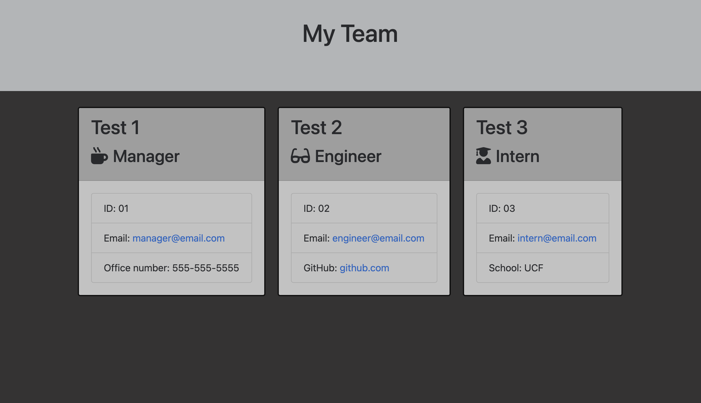

# Team Profile Generator

## Description 
This application can generate work team profiles using node.js in the command line. The user is prompted to select a type of employee to add, as well as additional information on each employee. Once finished an HTML page including all added employees will be created. 

## Instillation 
Install using node.js in the command line. The Inquirer package is also needed. 

## Screenshot 

